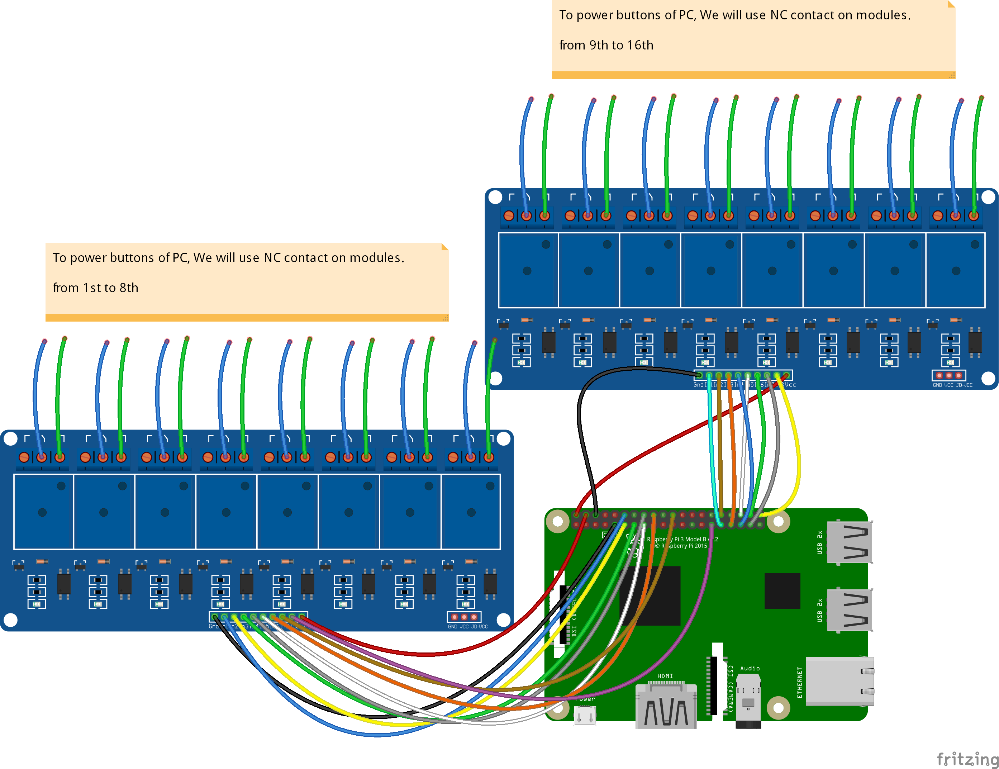
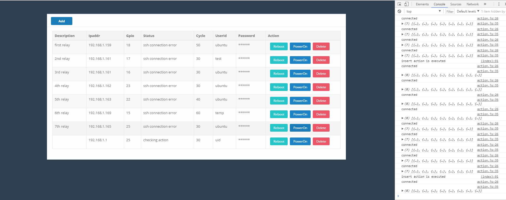

# rpi-flask-dashboard
Flask backend + frontend on the Pi in order to monitor/control mining machines

Building monitoring and control system for miners using RPI and Flask websocket solutions

# Wiring diagram

# Dashboard

